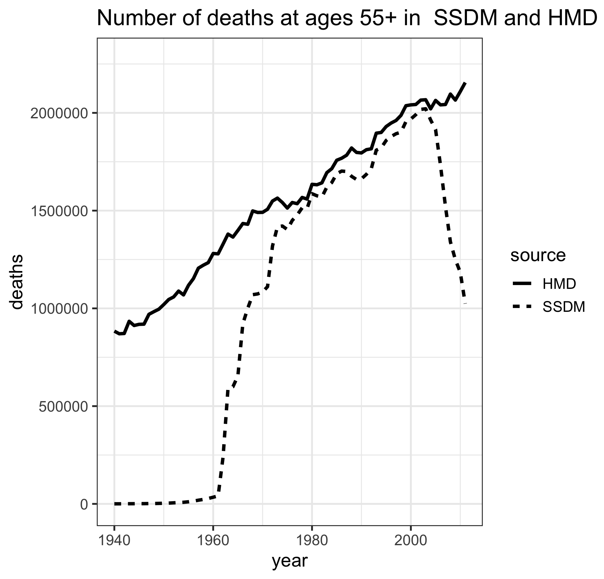

# Introduction
The 'CenSoc' project involves producing a dataset which contains records from the full-count 1940 US census to the social security deaths masterfile. The resulting CenSoc dataset provides researchers with a tool for studying mortality inequalities in the US and how conditions have changed over time. 

This document outlines the data sources and methods used to produce the initial CenSoc dataset. The results of the matching process and relative characteristics of the matched and unmatched records are also described. 

## The `censoc` R package
The CenSoc project has an accompanying R package `censoc`, which contains supporting R code and documentation used to create and work with the CenSoc dataset. Information about the package can be found [here](https://censoc.demog.berkeley.edu/index.html).

The CenSoc dataset was created by combining two separate data sources:
the 1940 census, and the Social Security Deaths Master file (SSDM). The
two data sources were matched based on unique identifiers of first name,
last name and age at the time of the census. Due to issues with
potential name changes with marriage, the matching process is restricted
to only include males.

As described below, the census observes individuals in 1940, and the
SSDM observes individuals in the period 1975-2005. Therefore, by
construction, the CenSoc dataset can only contain individuals who died
between 1975 and 2005.

## Data

The demographic and socioeconomic data come from the U.S.\ 1940 census,
which was completed on 1 April 1940. The census collected demographic
information such as age, sex, race, number of children, birthplace, and
mother's and father's birthplace. Geographic information, including
county and street address, and economic information such as wages,
non-wage income, hours worked, labor force status and ownership of house
was also collected. The 1940 census had a total of 132,164,569
individuals, 66,093,146 of whom were males.

The 1940 census records were released by the U.S.\ National Archives on
April 2, 2012. The original 1940 census records
were digitized by Ancestry.com and are available through the Minnesota
Population Center (MPC). The MPC provides a de-identified version of the
complete count census as part of the IPUMS-USA project.
However, names and other identifying information are not available from
the IPUMS website. Access to the restricted 1940 census data was granted
by agreement between UC Berkeley and MPC. The data are encrypted and can
only be accessed through computers or servers on the Berkeley demography
network.

Information on the age and date of death was obtained through the SSDM.
This contains a record of all deaths that have been reported to the
Social Security Administration (SSA) since 1962. The SSDM is used by
financial and government agencies to match records and prevent identity
fraud and is considered a public document under the Freedom of
Information Act. Monthly and weekly updates of the file are sold by the
National Technical Information Service of the U.S. Department of
Commerce. A copy of the 2011 version was obtained through the Berkeley
Library Data Lab.

The SSDM contains an individual's first name, last name, middle initial,
social security number, date of birth and date of death. The 2011 file
has 85,822,194 death records. The death dates span the years 1962-2011.
There are 76,056,377 individuals in the SSDM who were alive at the time
of the 1940 census.

Completeness of death reporting in the SSDM is lower pre-1970s, when a
substantial proportion of the population did not pay into the social
security system. Deaths are more likely to be reported at older ages,
when a person was more likely to be receiving social security benefits. 

To check the coverage of SSDM at the population level, the total number
of deaths by year reported in the SSDM was compared to those in the
Human Mortality Database (HMD). As
the Figure below illustrates, the
completeness of the SSDM file is high (around 95\%) for ages 55+ in the period
1975-2005. As such, the data used to create CenSoc is restricted to only
include deaths from SSDM that occurred between the period 1975-2005.




## Data preparation

For the Census dataset, the following pre-processing steps were done (using the `load_census` function):


-  Convert all name strings to upper case.
-   Remove the middle name. The original first name variable contains both
  first and middle name. The name string is split and only the first
  name is used for matching.
-
  Remove rows where either the first or last name are just question
  marks or blank.
-
  Create a match key by concatenating last name, first name and age.
-
  Subset the data to only include males.

For the social security deaths files, there are three raw files in which
rows contain a continuous string of characters. For each of the three
files, each row is split into social security number, last name, first
name, middle initial, date of death and date of birth. The three files
are then bound together to create one large file.

The following pre-processing steps are done (using the `load_socsec_deaths` function):

-
  Remove any trailing white space from first and last names
-
  Split date of birth and date of death to get day, month and year of
  birth and death.
-
  Calculate age of person at census. The age is calculated based on
  knowing the date of birth and that the 1940 census was run in April.
-
  Remove any deaths where the date of birth is missing
-
  Remove any deaths of people who born after 1940
-
  Remove any deaths before 1975
-
  Create a match key by concatenating last name, first name and census
  age.


## Match method

The two datasets are matched based on exact matches of first name, last
name and age. For example, a match key could be
\texttt{EYREJANE18}. Census records with a key that is not found
in the social security deaths database are not matched. The specific
steps are:

1.
  Load in the cleaned census and social security datasets.
2. 
  Remove duplicate keys.
3. 
  Merge the datasets based on key.

Due to file size, the matching step is done separately for each census
file in each U.S.\ state. The resulting national dataset is created by:

1. 
  Loading and binding all state matched files.
2. 
  Removing all rows that have duplicated keys.
\end{enumerate}

## Resulting dataset

A total of 7,564,451 individual males were matched across the census and
SSDM to create the CenSoc dataset. As the 1940 full count census had
66,093,146 males, this corresponds to a raw match rate of 11.4\%. A
total of 43,881,719 males in the census had unique keys; as such the
match rate on unique keys was 17.2\%.

The raw match rates differ markedly by cohort/age at census. As Table 1
illustrates, match rates are highest for 15-40 year olds. This
corresponds to cohorts born in 1900-1925.

```{r, echo = F, message = F, warning = F}
library(tidyverse)
library(knitr)
d <- read_csv("age_props.csv")
d <- d %>% 
  mutate(census_age_group = factor(census_age_group, levels = c(paste(seq(0,70, by = 5), seq(4, 74, by = 5), sep = "-"), "75+"))) %>% 
  arrange(census_age_group) %>% 
  rename(match_rate = prop, match_rate_unique = prop_unique, census_age = census_age_group) %>% 
  mutate(match_rate = round(match_rate*100, 1), match_rate_unique = round(match_rate_unique*100, 1)) %>% 
  rename(`Match rate (%)` = match_rate, `Census age` = census_age,  `Unique match rate (%)` = match_rate_unique)

kable(d, caption = "CenSoc match rates by age group")
```


These raw match rates do not take into consideration mortality. Some
individuals died before 1975, and some are still alive after 2005;
neither appears in the SSDM. In particular, the low rates at older ages
are mostly due to the fact that people of that age in the census have
already died by 1975. Thus we would never expect to get match rates of
100\% given we only observe a truncated window of deaths.       

# Merging with public-use IPUMS file

The CenSoc dataset contains information about individaul's birth date (and implied at the 1940 census), death date and state of residence in 1940. The dataset does not contain any other information on the characteristics of the individuals; however, by using the unique identifier information contained in the CenSoc dataset, the data can be merged back to the 1940 census available on the [IPUMS-USA](https://usa.ipums.org/usa/) website. 

For instructions on how to obtain full count census data from IPUMS, see documentation [here](https://censoc.demog.berkeley.edu/articles/ipums_document.html).


